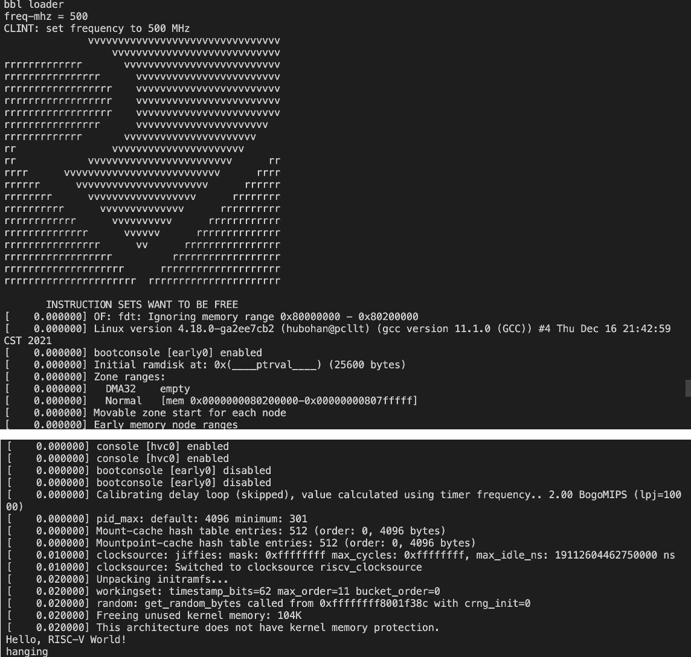
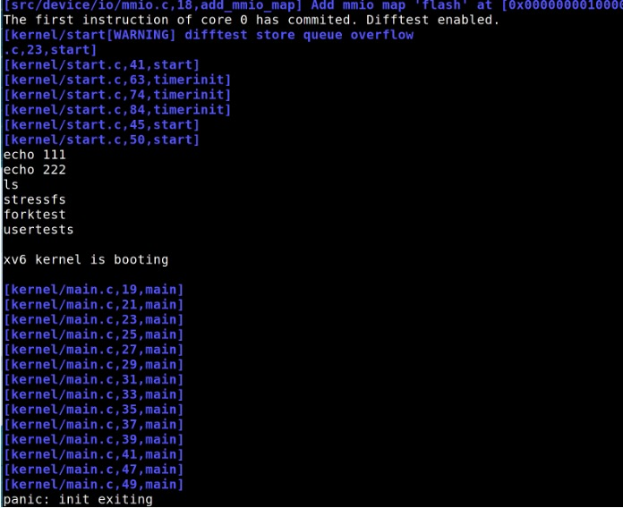
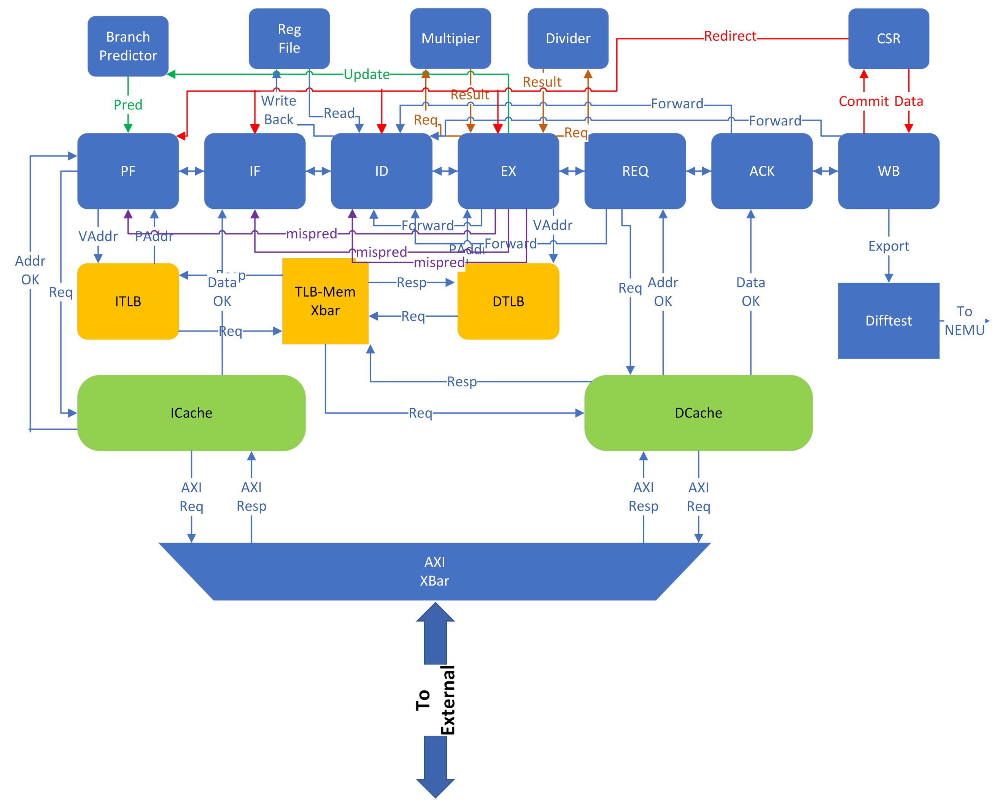
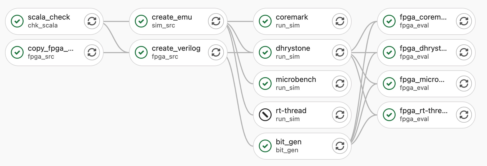

---
# Feel free to add content and custom Front Matter to this file.
# To modify the layout, see https://jekyllrb.com/docs/themes/#overriding-theme-defaults

layout: default
classes: wide

---
# 7–Stage Sequential Single-Issued RISC-V CPU (RV64IMA)

 Bohan Hu[1], Feiyu Chen[2], Guokai Chen[2], Haoyu Wang[2] and Songyue Wang[2]

 (in alphabet order)

[1] Harbin Institute of Technology, [2] University of Chinese Academy of Sciences

We designed a single-issued 7-level sequential pipelined processor that supports RISC-V64IMA ISA, with Chisel HDL and Verilog. It integrates MMU that supports Sv39, and integrates L1 I-cache and D-cache design, and accesses externally through AXI4 bus. It includes complete CSR and CLINT design, as well as interrupt handling. It is an entry for [Dream Cup: Chinese Youth IC Technology Competition](http://cyictc.yeeol.com/) (CYICTC' 21): Open-source Chip
Development and Performance Optimization Track. Now it's available at [Gitee Repo](https://gitee.com/landonwong/dreamcup).

## Demo
+ Running **Linux 4.18** on FPGA\
  

+ Running [xv6-riscv](https://github.com/mit-pdos/xv6-riscv) on FPGA\
  

## Architecture and ISA supported
The following figure shows the CPU control path.\
\
It Supports RISC-V64IMA means:
+ It has a 64-bit multiplier and divider supporting MUL and DIV for integers.
+ It support fence.i (consistency of L1 Cache) and atomic instructions (rv32/64.amo).

## Design and Evaluation Framework

+ Design\
  We used Verilog to design main pipeline structure and used Chisel to design some components: CSR, CLINT, TLB(MMU), AXI4Converter, multiplier and divider.
  
+ Difftest in Stimulation\
  We built a general difftest framework based on [NEMU](https://github.com/OpenXiangShan/NEMU) and [OpenXiangShan](https://github.com/OpenXiangShan/XiangShan). Our framework is available at [Gitee](https://gitee.com/chenguokai/nutonlyshell). It sitmulates DUT with verilator, and compares all GPRs and CSRs to Golden-Model NEMU (support RV64GC) and updates CSR and CLINT status at every cycle. Based on this, we only used 2 days to finish debug and successfully booted Linux Kernel.
  
+ FPGA Evaluation\
  We customized a CI workflow on SERVE. It will automatically called Vivado to build a HW framework and generate bitstream. After it, a cloud FPGA will be loaded with SW bin files and run on our CPU logic.\
  
