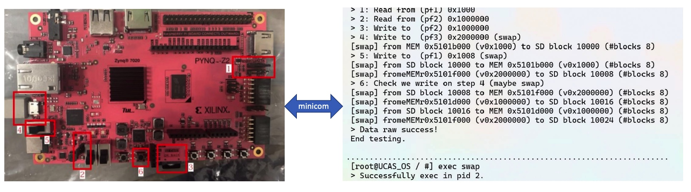

---
# Feel free to add content and custom Front Matter to this file.
# To modify the layout, see https://jekyllrb.com/docs/themes/#overriding-theme-defaults

layout: default
classes: wide

---
# UCAS-OS

UCAS-OS is a unix-like OS based on RISC-V64GC, and it was designed to run on FPGA on dual-core Rocket Chip. It has rich system calls, isolation and security (different processor modes, virtual memory), synchronization and communication, peripheral drivers and file systems. It's available at [Gitee Repo](https://gitee.com/landonwong/UCAS_OS).



## Demo
+ Receive ELF file from NIC to local FS and execute it!
+ Parallel add test on scheduler with dual core!

## HighLight
+ UCAS-OS can schedule with dual-core.
+ UCAS-OS boots from SD card. And it also have FS at SD card. 
+ Support virtual memory (VM) and page management, also use [Clock](https://en.wikipedia.org/wiki/Page_replacement_algorithm) page replacement algorithm and Copy-on-write(COW).
+ It has a NIC driver which is on FPGA, thus it can send and receive TCP packets.

## Isolation and Protection
+ Kernel runs on S-mode, user threads/processes run on U-mode.
+ It use Sv39 MMU realize virtual memory (VM) management.

## Syscalls and interrupt handlers
+ It supports 59 syscalls including
  + I/O\
    getchar, putchar, read_sd_card, write_sd_card, file system related and so on
  + Processes\
    set_priority, yield, spawn, exit, kill and so on
  + Synchronization and communication\
    lock, semaphore, barrier, mailbox, shared memory
+ It can handle all exceptions and external interrupt through [PLIC](https://github.com/riscv/riscv-plic-spec)

## NIC driver

I transplant Xilinx NIC driver (designed for ARM) to UCAS-OS.

```
    .
    ├── drivers
    │     ├── emacps                # Drivers of GEM
    │     │     ├── xemacps_main.c  # GEM: RX TX main driver
    │     │     └── ...
    │     ├── net.c                 # GEM Drivers-to-kernel interface
    │     ├── plic.c                # Platform-Level Interrupt Controller Driver
    │     └── ...
    └── ...    
```

## Memory
In our Block Design for Programable Logic (PL) on FPGA, DDR mapper begin at `0x5000_0000`, end at `0x6000_0000`.
1. Kernel Memory Mapping


  ```
   Phy addr    |   Memory    |     Kernel vaddr

  0x5f000000   +-------------+  0xffffffc05f000000
               | Kernel PTEs | 
  0x5e000000   +-------------+  0xffffffc05e000000
               | Kernel Heap | 
  0x5d000000   +-------------+  0xffffffc05d000000
               |   Free Mem  |
               |     Pages   | 
               |  for alloc  | 
  0x51000000   +-------------+  0xffffffc051000000
               |     ...     | 
  0x50500000   +-------------+  0xffffffc050500000
               |   Kernel    |
               |   Segments  |
  0x50400000   +-------------+  0xffffffc050400000
               | vBoot Setup |
               |   (boot.c)  |
  0x50300000   +-------------+  0xffffffc050300000
               |     ...     |
  0x50201000   +-------------+  N/A
               |  Bootblock  |
  0x50200000   +-------------+  N/A
               |     BBL     |
  0x50000000   +-------------+  N/A
  ```
    
    
  2. User Memory Mapping


  ```
  0xffffffc000000000   +-------------+ 
                       |     ...     |
         0xf00011000   +-------------+ 
                       |  User Stack | 
         0xf00010000   +-------------+  
                       |     ...     | 
             0x20000   +-------------+ 
                       |   Program   |
                       |   Segments  |
             0x10000   +-------------+ 
                       |     ...     |
                 0x0   +-------------+ 
  ```
## Acknowledgement
